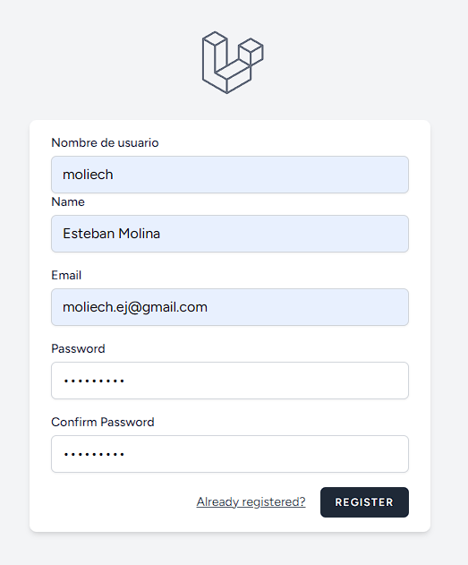
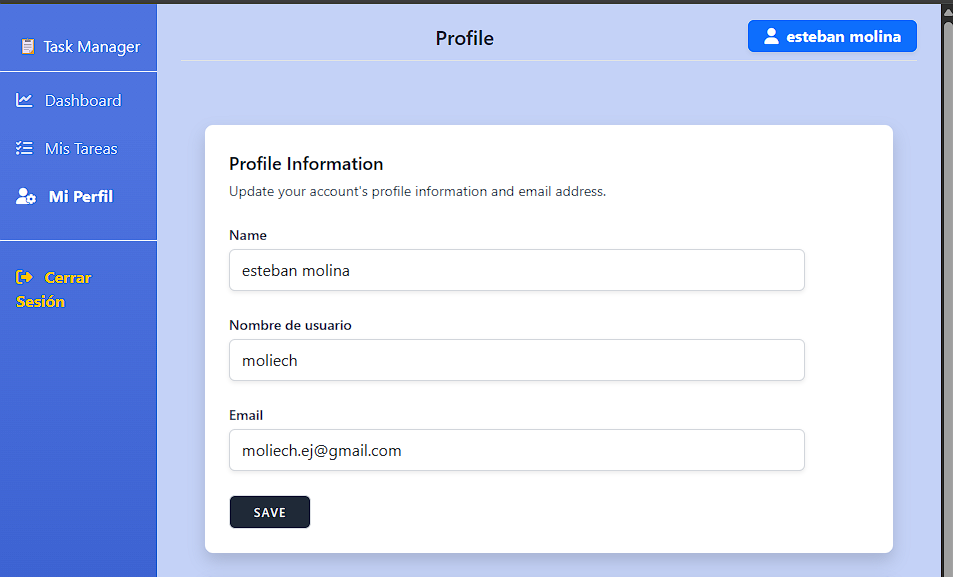

# Practica Task Manager

Este repositorio contiene la práctica del proyecto **Task Manager** desarrollado en Laravel.

## 📋 Descripción de la Práctica
Durante esta práctica se construyó un gestor de tareas estructurado bajo el patrón MVC, integrando autenticación de usuarios y adaptando un panel administrativo con diseño híbrido.

### Características implementadas:
1. **Modelos, Migraciones y Controladores (MVC)**:
   - Gestión de **Tareas** (Tasks) con atributos como título, estado (pendiente, en progreso, completada), fecha límite y categoría.
   - Gestión de **Categorías** (Categories) asociadas a las tareas.
   - Rutas protegidas y controladores de recursos para las tareas.

2. **Autenticación (Laravel Breeze)**:
   - Registro de usuarios, inicio de sesión, confirmación de contraseña, verificación de correo y restablecimiento de contraseña.

3. **Interfaz de Usuario y Plantilla Híbrida**:
   - Creación de un panel principal responsivo con **Bootstrap 5** (`layouts/app.blade.php`).
   - Soporte híbrido para vistas tradicionales (`@yield`) y componentes de Blade (`$slot`) para integrar de forma fluida el listado de tareas (Bootstrap) y el Dashboard/Perfil (Tailwind/Alpine.js).
   - Sidebar lateral con navegación integrada para:
     - **Dashboard**
     - **Mis Tareas**
     - **Mi Perfil**
     - **Cerrar Sesión** (Logout seguro mediante formulario POST).

4. **Corrección de Conflictos de Tema**:
   - Configuración de la estrategia de modo oscuro de Tailwind CSS a `'class'` en `tailwind.config.js` para evitar conflictos visuales (textos o inputs invisibles) cuando el sistema operativo del usuario tiene el modo oscuro activado.

---

## 🚀 Requisitos y Configuración de Ejecución

El proyecto utiliza **Laravel Sail** (Docker) para simplificar el entorno de desarrollo local.

### 1. Clonar el repositorio
```bash
git clone https://github.com/moliech/PracticaTaskManager.git
cd PracticaTaskManager
```

### 2. Configurar el archivo de entorno
Copia el archivo de ejemplo para crear tu archivo `.env`:
```bash
cp .env.example .env
```
*(Asegúrate de configurar los puertos y credenciales de base de datos adecuados para tu entorno local en el archivo `.env` recién creado).*

### 3. Levantar los contenedores de Sail
```bash
./vendor/bin/sail up -d
```

### 4. Instalar dependencias y ejecutar migraciones
```bash
# Instalar dependencias de PHP y Node
./vendor/bin/sail composer install
./vendor/bin/sail npm install

# Ejecutar las migraciones y seeders de la base de datos
./vendor/bin/sail php artisan migrate --seed

# Generar la llave de la aplicación
./vendor/bin/sail php artisan key:generate
```

### 5. Compilar recursos frontend
Para compilar los recursos de CSS (Tailwind) y JavaScript (Alpine.js) para desarrollo:
```bash
./vendor/bin/sail npm run build
# O para ver cambios en tiempo real
./vendor/bin/sail npm run dev
```

---

## 🧪 Pruebas
Para ejecutar las pruebas unitarias y de integración del proyecto:
```bash
./vendor/bin/sail php artisan test
```

---

## 🔌 API de Tareas (Autenticación JWT)

El proyecto incluye una API REST para la gestión de tareas, protegida mediante tokens **JWT (JSON Web Tokens)** utilizando el paquete `tymon/jwt-auth`.

### 🔑 Configuración del Secreto JWT
Para firmar y validar los tokens de acceso, asegúrate de generar la clave secreta de JWT en tu archivo `.env`:
```bash
./vendor/bin/sail php artisan jwt:secret
```

### 📌 Listado de Endpoints
Todas las rutas de la API están bajo el prefijo `/api`.

| Método | Endpoint | Descripción | Requiere Autenticación | Cuerpo del Request / Parámetros |
| :--- | :--- | :--- | :---: | :--- |
| **POST** | `/api/register` | Registrar un nuevo usuario | No | `name`, `username`, `email`, `password`, `password_confirmation` |
| **POST** | `/api/login` | Iniciar sesión y obtener token JWT | No | `email`, `password` |
| **POST** | `/api/logout` | Cerrar sesión e invalidar el token | Sí (Bearer) | Ninguno |
| **GET** | `/api/me` | Obtener el perfil del usuario autenticado | Sí (Bearer) | Ninguno |
| **GET** | `/api/listarUsuarios` | Listar todos los usuarios del sistema | Sí (Bearer) | Ninguno |
| **GET** | `/api/listarUsuario/{id}` | Ver los detalles de un usuario específico | Sí (Bearer) | `id` en la URL |
| **GET** | `/api/tareas` | Listar todas las tareas (con su categoría y creador) | Sí (Bearer) | Ninguno |
| **POST** | `/api/tareas` | Crear una nueva tarea | Sí (Bearer) | `titulo`, `descripcion` (opcional), `fecha_limite` (opcional), `category_id` |
| **GET** | `/api/tareas/{id}` | Obtener el detalle de una tarea específica | Sí (Bearer) | `id` en la URL |
| **PUT/PATCH**| `/api/tareas/{id}` | Editar una tarea (Solo creador o Administrador) | Sí (Bearer) | `titulo` (opcional), `descripcion` (opcional), `fecha_limite` (opcional), `category_id` (opcional), `estado` (opcional) |
| **DELETE** | `/api/tareas/{id}` | Eliminar una tarea (Solo creador o Administrador) | Sí (Bearer) | `id` en la URL |

> [!TIP]
> Para probar los endpoints que requieren autenticación, debes incluir el token obtenido en el login dentro de las cabeceras HTTP de tu solicitud como `Authorization: Bearer <tu_token>`.

---

## 📸 Entregables de la Práctica (Capturas y Código)

A continuación se presentan las capturas de pantalla de la implementación y el código de las modificaciones realizadas para el campo **username** (Nombre de usuario).

### 1. Capturas de Pantalla

#### 📝 Formulario de Registro
Formulario de registro (`/register`) incluyendo el nuevo campo "Nombre de usuario":



#### 👤 Perfil del Usuario
Sección de perfil de usuario (`/profile`) mostrando el campo para visualizar y actualizar el "Nombre de usuario":



---

### 💻 Código de las Modificaciones en el Repositorio

#### A. Migración de la Tabla `users` (`database/migrations/0001_01_01_000000_create_users_table.php`)
Se agregó la columna `username` única:
```php
Schema::create('users', function (Blueprint $table) {
    $table->id();
    $table->string('name');
    $table->string('username')->unique(); // nuevo campo
    $table->string('email')->unique();
    $table->timestamp('email_verified_at')->nullable();
    $table->string('password');
    $table->rememberToken();
    $table->timestamps();
});
```

#### B. Modelo de Usuario (`app/Models/User.php`)
Se agregó `'username'` al atributo `$fillable`:
```php
protected $fillable = [
    'name',
    'email',
    'password',
    'username',
];
```

#### C. Vista del Formulario de Registro (`resources/views/auth/register.blade.php`)
Input para el nombre de usuario:
```html
<!-- Username -->
<div>
    <x-input-label for="username" :value="__('Nombre de usuario')" />
    <x-text-input id="username" class="block mt-1 w-full" type="text" name="username" :value="old('username')" required autofocus />
    <x-input-error :messages="$errors->get('username')" class="mt-2" />
</div>
```

#### D. Controlador de Registro Web (`app/Http/Controllers/Auth/RegisteredUserController.php`)
Validación y almacenamiento de `username` en el método `store`:
```php
$request->validate([
    'name' => ['required', 'string', 'max:255'],
    'username' => ['required', 'string', 'max:255', 'unique:users'], // nuevo campo
    'email' => ['required', 'string', 'lowercase', 'email', 'max:255', 'unique:'.User::class],
    'password' => ['required', 'confirmed', Rules\Password::defaults()],
]);

$user = User::create([
    'name' => $request->name,
    'username' => $request->username,
    'email' => $request->email,
    'password' => Hash::make($request->password),
]);
```

#### E. Formulario de Edición de Perfil (`resources/views/profile/partials/update-profile-information-form.blade.php`)
Input para visualizar y editar el nombre de usuario:
```html
<div>
    <x-input-label for="username" :value="__('Nombre de usuario')" />
    <x-text-input id="username" name="username" type="text" class="mt-1 block w-full" :value="old('username', $user->username)" required autocomplete="username" />
    <x-input-error class="mt-2" :messages="$errors->get('username')" />
</div>
```

#### F. Validación de Actualización de Perfil (`app/Http/Requests/ProfileUpdateRequest.php`)
Regla para validar la actualización de `username`:
```php
public function rules(): array
{
    return [
        'name' => ['required', 'string', 'max:255'],
        'username' => [
            'required',
            'string',
            'max:255',
            Rule::unique(User::class)->ignore($this->user()->id),
        ],
        'email' => [
            'required',
            'string',
            'lowercase',
            'email',
            'max:255',
            Rule::unique(User::class)->ignore($this->user()->id),
        ],
    ];
}
```

#### G. Registro del Campo en la API (`app/Http/Controllers/Api/AuthController.php`)
Validación y creación de `username` para el registro vía API:
```php
$validated = $request->validate([
    'name' => 'required|string|max:255',
    'username' => 'required|string|max:255|unique:users',
    'email' => 'required|string|email|max:255|unique:users',
    'password' => 'required|string|min:8|confirmed',
]);

$user = User::create([
    'name' => $validated['name'],
    'username' => $validated['username'],
    'email' => $validated['email'],
    'password' => bcrypt($validated['password']),
    'rol' => 'user',
]);
```


